<!DOCTYPE html>
<html lang="en">
<head>
    <meta charset="UTF-8">
    <meta name="viewport" content="width=device-width, initial-scale=1.0">
    <link rel="stylesheet"
        href="https://fonts.googleapis.com/css2?family=Material+Symbols+Rounded:opsz,wght,FILL,GRAD@20..48,100..700,0..1,-50..200" />
        <link href="https://fonts.googleapis.com/css2?family=Roboto:ital,wght@0,100..900;1,100..900&display=swap"
        rel="stylesheet">
</head>
<body>

<h3><strong>📟 Languages</strong></h3>

<h3><strong>🗓️ Habits of development (💤)</strong></h3>

<h3><strong>☣️ Project Zomboid Mod Pages</strong></h3>

</body>
</html>
